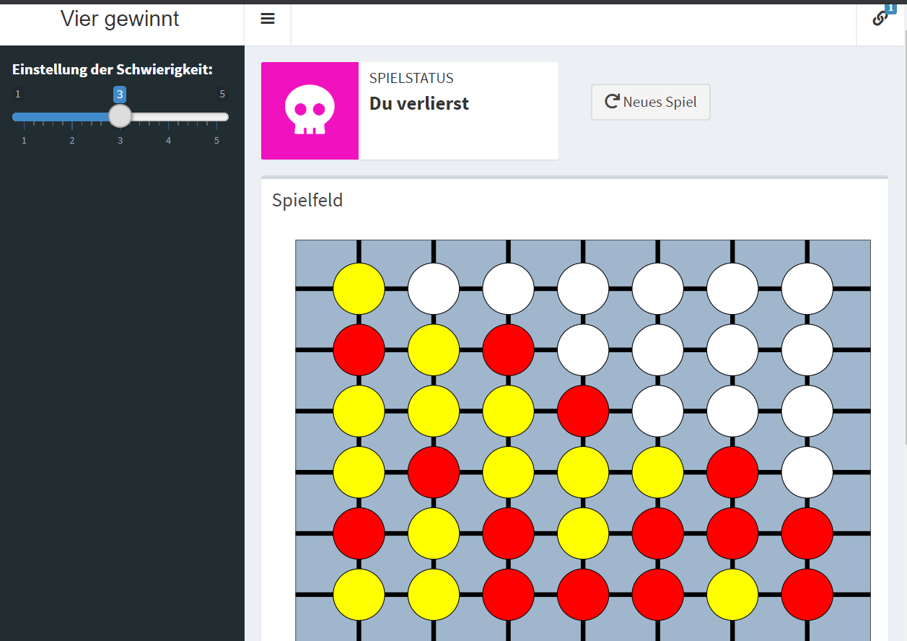

<!-- README.md is generated from README.Rmd. Please edit that file -->

# Vier gewinnt\!

Ein kleines Mini-Projekt, um den Minimax Algorithmus auszuprobieren.
Ergebnis: Ein nicht sehr schlauer, aber auch nicht sehr dummer AI-Gegner
für das Spiel Vier Gewinnt. Dazu eine Shiny-Web-Application zum
Spielen:)

## Link zum “schöneren” Spiel

Gleicher Algorithmus und mit Link zum richtigen Spielen: [Hier
klicken](https://github.com/EmanuelSommer/vier_gewinnt_pretty#vier-gewinnt)

## Teaser

